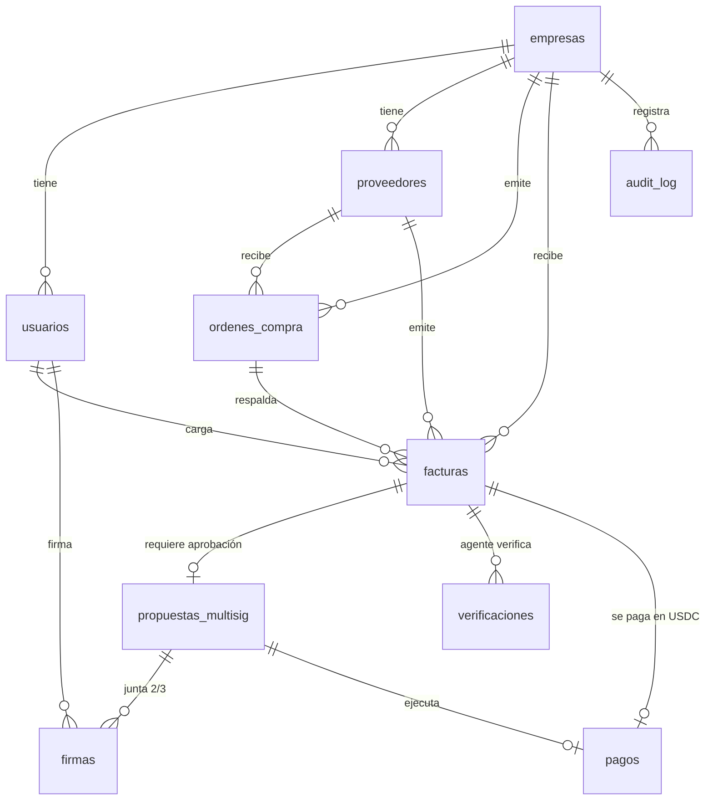

# Base de datos — Logis

> Documento interno del equipo (español). Define el modelo de datos del MVP.

## Arquitectura: híbrida off-chain + on-chain

**No guardamos la app "en blockchain"** — sería caro, lento y público. El diseño es:

| Capa | Qué guarda | Tecnología |
|---|---|---|
| **Off-chain** (BD de la app) | Usuarios, roles, proveedores, facturas, órdenes de compra, estados del flujo | **SQLite + Prisma** (un archivo, cero instalación; el esquema migra igual a Postgres si escalamos) |
| **On-chain** (capa de confianza) | Aprobaciones multisig 2/3 y ejecución del pago USDC con el hash de la factura embebido | **Solana devnet** — Squads (multisig) + SPL Token-2022 + Memo Program |

La BD guarda *referencias* a lo on-chain (`tx_signature`, `multisig_address`, `proposal_id`) para que cada pago tenga evidencia verificable. La cadena es la fuente de verdad para **aprobaciones y pagos**; la BD es la fuente para **todo lo demás del workflow**.

---

## Tablas

### `empresas` — la empresa que usa la plataforma

| Columna | Tipo | Notas |
|---|---|---|
| id | string (cuid) | PK |
| nombre | string | Razón social |
| pais | string | "AR", etc. |
| multisig_address | string? | Dirección del multisig Squads 2/3 de la empresa (se crea al configurar) |
| created_at | datetime | |

Relaciones: 1─N con `usuarios`, `proveedores`, `ordenes_compra`, `facturas`.

### `usuarios` — RF-01 (roles internos)

| Columna | Tipo | Notas |
|---|---|---|
| id | string | PK |
| empresa_id | string | FK → empresas |
| nombre | string | |
| email | string | único |
| password_hash | string | |
| rol | enum | `ADMIN` \| `JEFE` \| `SUPERVISOR` \| `EMPLEADO` |
| wallet_pubkey | string? | Wallet que firma aprobaciones (RF-02). Solo admins/jefes/supervisores la necesitan |
| activo | bool | |
| created_at | datetime | |

Regla de negocio: `EMPLEADO` carga facturas pero **no firma aprobaciones** (RF-05).

### `proveedores` — RF-03 (alta de proveedores)

| Columna | Tipo | Notas |
|---|---|---|
| id | string | PK |
| empresa_id | string | FK → empresas |
| nombre | string | |
| cuit_o_tax_id | string? | Identificación fiscal (AR u otro país) |
| pais | string | Local o exterior (RF-10) |
| email | string? | |
| wallet_usdc | string | **Wallet destino del pago USDC** — campo crítico |
| activo | bool | |
| created_at | datetime | |

Relaciones: 1─N con `ordenes_compra`, `facturas`.

### `ordenes_compra` — OC contra las que se matchean facturas

| Columna | Tipo | Notas |
|---|---|---|
| id | string | PK |
| empresa_id | string | FK → empresas |
| proveedor_id | string | FK → proveedores |
| numero | string | N° de OC visible |
| monto | decimal | |
| moneda | string | "USD" (se liquida en USDC) |
| estado | enum | `ABIERTA` \| `CERRADA` \| `ANULADA` |
| created_at | datetime | |

### `facturas` — RF-04 (carga manual y CSV)

| Columna | Tipo | Notas |
|---|---|---|
| id | string | PK |
| empresa_id | string | FK → empresas |
| proveedor_id | string | FK → proveedores |
| orden_compra_id | string? | FK → ordenes_compra |
| numero | string | N° de factura del proveedor |
| monto | decimal | |
| moneda | string | "USD" |
| hash_sha256 | string | Hash del contenido de la factura → va on-chain en el memo del pago (RF-07) |
| estado | enum | `CARGADA` → `EN_APROBACION` → `APROBADA` → `PAGADA` / o `RECHAZADA` / `VERIFICACION_FALLIDA` |
| cargada_por | string | FK → usuarios (quien la subió — no puede aprobarla, SecondSet) |
| origen | enum | `MANUAL` \| `CSV` |
| created_at | datetime | |

Relaciones: N─1 proveedor, N─1 OC, 1─1 `propuestas_multisig`, 1─N `verificaciones`, 1─1 `pagos`.

### `propuestas_multisig` — RF-05 (aprobación 2/3 via Squads)

| Columna | Tipo | Notas |
|---|---|---|
| id | string | PK |
| factura_id | string | FK → facturas (única) |
| multisig_address | string | Multisig Squads que aprueba |
| proposal_index | int | Índice de la propuesta/transacción dentro del multisig (referencia on-chain) |
| umbral | int | 2 |
| estado | enum | `PENDIENTE` \| `UMBRAL_ALCANZADO` \| `EJECUTADA` \| `RECHAZADA` \| `CANCELADA` |
| created_at | datetime | |

Relaciones: 1─N `firmas`.

### `firmas` — cada firma individual del multisig

| Columna | Tipo | Notas |
|---|---|---|
| id | string | PK |
| propuesta_id | string | FK → propuestas_multisig |
| usuario_id | string | FK → usuarios (solo roles que firman) |
| tx_signature | string | Firma de la aprobación on-chain |
| created_at | datetime | |

Regla: una firma por usuario por propuesta. La propuesta se ejecuta recién con 2 firmas.

### `verificaciones` — RF-06 (agente de pagos)

| Columna | Tipo | Notas |
|---|---|---|
| id | string | PK |
| factura_id | string | FK → facturas |
| resultado | enum | `OK` \| `RECHAZADA` |
| checks | json | `{ oc_coincide, proveedor_registrado, monto_ok, sin_duplicados }` |
| detalle | string? | Motivo del rechazo |
| created_at | datetime | |

El agente corre la verificación **solo después** de que el multisig alcanzó 2/3. Si `resultado = RECHAZADA` la factura queda marcada y **no se paga** (RNF-03).

### `pagos` — RF-07/08 (ejecución y conciliación)

| Columna | Tipo | Notas |
|---|---|---|
| id | string | PK |
| factura_id | string | FK → facturas (única) |
| propuesta_id | string | FK → propuestas_multisig |
| monto_usdc | decimal | |
| destino_wallet | string | Copia de proveedores.wallet_usdc al momento de pagar |
| tx_signature | string? | **La prueba on-chain del pago** (link a explorer devnet) |
| memo | string? | `factura:{hash_sha256}` — lo embebido en la tx |
| estado | enum | `PENDIENTE` \| `ENVIADO` \| `CONFIRMADO` \| `FALLIDO` |
| created_at | datetime | |
| confirmed_at | datetime? | |

### `audit_log` — RF-09 (historial auditable)

| Columna | Tipo | Notas |
|---|---|---|
| id | string | PK |
| empresa_id | string | FK → empresas |
| entidad | string | "factura" \| "pago" \| "proveedor" \| "propuesta" |
| entidad_id | string | |
| accion | string | "cargada" \| "firmada" \| "verificada" \| "pagada" \| "rechazada" |
| actor_id | string? | FK → usuarios (null = agente automático) |
| detalle | json? | Contexto del evento |
| tx_signature | string? | Si el evento tiene huella on-chain |
| created_at | datetime | |

---

## Diagrama de relaciones



## Flujo completo (un caso punta a punta)

```
empleado carga factura        → facturas(CARGADA) + audit_log
sistema crea propuesta Squads → propuestas_multisig(PENDIENTE)
jefe firma en Squads          → firmas + audit_log
supervisor firma en Squads    → firmas (2/3) → propuesta UMBRAL_ALCANZADO
agente verifica factura       → verificaciones(OK/RECHAZADA)
si OK: ejecuta pago USDC      → pagos(ENVIADO→CONFIRMADO) + tx on-chain con memo=hash factura
dashboard conciliación        → une factura ↔ pago ↔ tx_signature (RF-08)
```

## On-chain: qué vive afuera de la BD

| Dato | Dónde |
|---|---|
| Multisig 2/3 (quiénes firman, umbral) | Cuenta Squads en devnet (`multisig_address`) |
| Aprobaciones | Firmas en la transacción del multisig (`tx_signature` en `firmas`) |
| Pago | Transfer USDC (SPL Token-2022) + Memo Program con `factura:{sha256}` |
| Prueba pública | Cualquier jurado verifica `tx_signature` en explorer.solana.com?cluster=devnet |

## Notas de implementación

- Prisma + SQLite en `apps/api/prisma/schema.prisma`. La DB es un archivo `dev.db` (gitignored).
- Enums y tipos se comparten con el front vía `packages/shared`.
- Si la demo necesita datos públicos entre varias máquinas, se migra a Postgres (Supabase/Neon) cambiando solo el `provider` de Prisma — el esquema queda igual.
- Seeds: script con 1 empresa, 4 usuarios (uno por rol), 2 proveedores (1 local, 1 exterior), 1 OC y 2 facturas de ejemplo.
